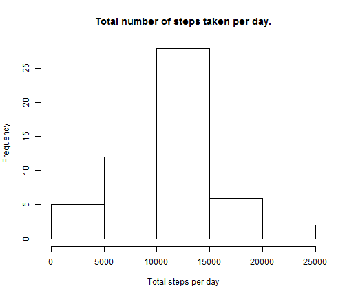
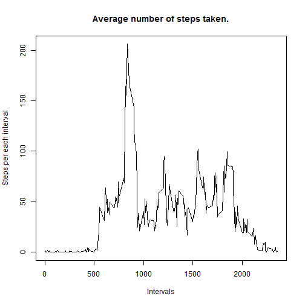
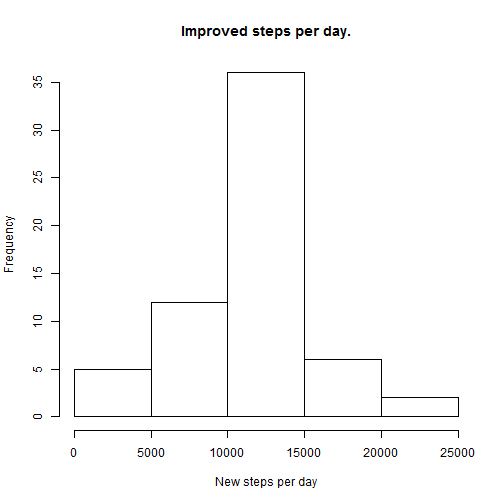
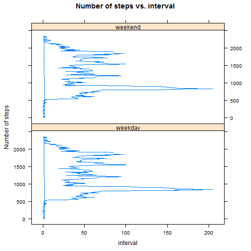

Peer Assessment 1
========================================================

First of all we will load the data from the activity.csv file placed inside the current working directory.


```r
Data <- read.csv("activity.csv")
Data$steps <- as.numeric(Data$steps)
Data$date <- as.Date(Data$date, "%Y-%m-%d")
Data$interval <- as.numeric(Data$interval)
```


1.a. Plotting the total number of steps per day:
----------------------------------------------

Now we calculate the total number of steps per day and store it in a seperate variable StepsPerDay, we have simply ignored the NA values in the data and pretend they are Not Available there:


```r
StepsPerDay <- tapply(Data$steps, Data$date, sum)
hist(StepsPerDay, xlab = "Total steps per day", main = "Total number of steps taken per day.")
```

 


1.b. Calculate the mean and median:
-----------------------------------

Now, let us look at the mean and median values of the total number of steps per day:
    

```r
mean(StepsPerDay, na.rm = TRUE)
```

```
## [1] 10766
```

```r
median(StepsPerDay, na.rm = TRUE)
```

```
## [1] 10765
```

Hmm, quite close they are.

2. Average daily activity pattern:
----------------------------------

Now lets take the average daily activity pattern, for this we will create a new data.frame using the ddply function from the plyr package:


```r
library(plyr)
StepsPerInterval <- ddply(Data, .(interval), summarize, steps = mean(steps, 
    na.rm = TRUE))
plot(StepsPerInterval$interval, StepsPerInterval$steps, xlab = "Intervals", 
    ylab = "Steps per each interval", main = "Average number of steps taken.", 
    type = "l")
```

 


The interval with the most number of steps among these is:


```r
StepsPerInterval$interval[StepsPerInterval$steps == max(StepsPerInterval$steps)]
```

```
## [1] 835
```


3. Imputing the missing values:
-------------------------------

Now, lets see how many NAs we actually have in our data.


```r
sum(is.na(Data$steps))
```

```
## [1] 2304
```


My! My! There are a lot of NAs in steps in the original data, that would biase all our calculations. Let's remove them and substitute with something meaningful.
<br>**Strategy:** Impute them with the average steps of that interval.


```r
NewData = data.frame(Data)
NewData$steps[is.na(NewData$steps)] = StepsPerInterval$steps[which(StepsPerInterval$interval == 
    NewData$interval[is.na(NewData$steps)])%%288 + 1]
NewData$StepsPerInterval <- tapply(NewData$steps, NewData$interval, mean)
sum(is.na(NewData$steps))
```

```
## [1] 0
```


The sum shows we do not have any NAs anymore. <br>Now let us build a new histogram with these values:


```r
hist(tapply(NewData$steps, NewData$date, sum), xlab = "New steps per day", main = "Improved steps per day.")
```

 

```r
Sum <- as.numeric(tapply(NewData$steps, NewData$date, sum))
mean(Sum)
```

```
## [1] 10766
```

```r
median(Sum)
```

```
## [1] 10766
```


Looks like they are almost equal!


```r
mean(StepsPerDay, na.rm = TRUE) == mean(Sum)
```

```
## [1] TRUE
```

```r
median(Sum) - median(StepsPerDay, na.rm = TRUE)
```

```
## [1] 1.189
```


**Conclusion:** Imputing missing values does not seem to have any impact on the mean, while the median did increase a little bit.

4. Difference in activity patterns between weekdays and weekends:
-----------------------------------------------------------------

Here, we are going to compare the activity patterns on weekdays with those on weekends. For this purpose we add a new factor variable to the data differentiating the day as "weekday" or the "weekend":


```r
NewData$Day <- ifelse(weekdays(NewData$date) == "Saturday" | weekdays(NewData$date) == 
    "Sunday", "weekend", "weekday")
NewData$Day <- as.factor(NewData$Day)
library(lattice)
xyplot(interval ~ StepsPerInterval | Day, data = NewData, layout = c(1, 2), 
    type = "l", xlab = "interval", ylab = "Number of steps", main = "Number of steps vs. interval")
```

 


That's all folks!
=================
